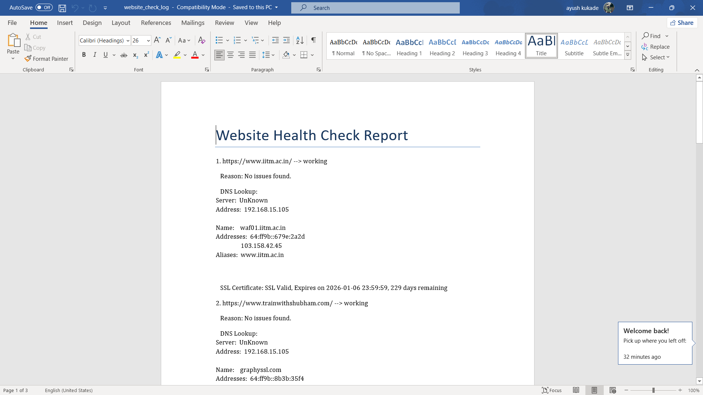

# Website Health Check 🕵️‍♂️🔍

**Author:** Aayush Kukade  
[LinkedIn](https://www.linkedin.com/in/aayushkukade/) | [GitHub](https://github.com/its-tsukii/) | [Medium](https://medium.com/@sroy10012001)

---


---
## What Is This Magical Thing? ✨

Ever wondered if your favorite websites are secretly plotting to go down on you?  
Or if their SSL certificates are about to *poof* disappear?  
Well, worry no more! This script is here to stalk your websites  — *I mean*, lovingly check their health status — regularly.

It runs DNS lookups, pokes their HTTP responses, and even gives you the lowdown on SSL certificates and expiry dates. It’s like a health checkup for your websites, minus the awkward waiting room magazines.

---

## How Does It Work? 🛠️

1. You give it a list of websites (in `websites.txt`).  
2. It does some DNS detective work.  
3. It sends polite HTTP requests (no spam, promise).  
4. It snoops on SSL certificates and their expiry dates (so your sites don’t get cold feet).  
5. It bundles all the juicy details into a neat Word document report.  

---

## Why Should You Care? 🤔

- Keep your websites from surprising you with nasty downtime.  
- Avoid the dreaded "Your connection is not private" message.  
- Brag to your boss or friends with a slick automated health report.  
- Impress your cat by showing how tech-savvy you are.  

---

## How to Use This Bad Boy 🏃‍♂️

1. **Make sure you have Python 3 installed.**  
2. Clone this repo (or steal it — just kidding, fork it!).  
3. Add your websites to `websites.txt`, one URL per line.  
4. Install dependencies:  
```
   pip install -r requirements.txt
```  
Run the script:

```
python check_websites_doc.py
```
Marvel at the website_check_log.docx report.

Screenshots:
1.Workflow


2.Docx file



Tips for workflow :
<br> After the workflow successfull build you can download the docx file from the github actions artifact located at actions>artifact>health check logs

Bonus Round: Automation! ⚙️
Want this health check to run automatically?
Set it up in GitHub Actions and let the robots do the work while you sip coffee ☕.

Disclaimer 📝
This script does not fix your websites — it just tells you what’s wrong.

No websites were harmed during these health checks.

Your cat’s approval is not guaranteed.

Made with ❤️ and a bit of caffeine by Aayush Kukade
[LinkedIn](https://www.linkedin.com/in/aayushkukade/) | [GitHub](https://github.com/its-tsukii/) | [Medium](https://medium.com/@sroy10012001)
